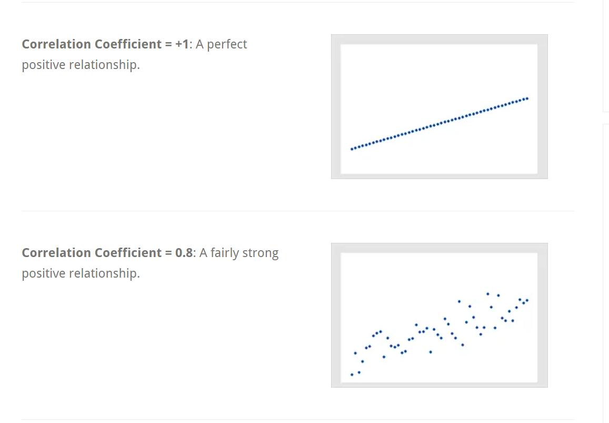
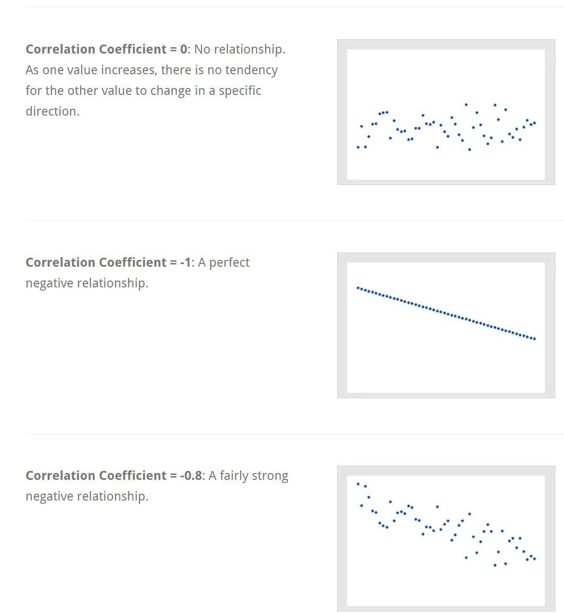
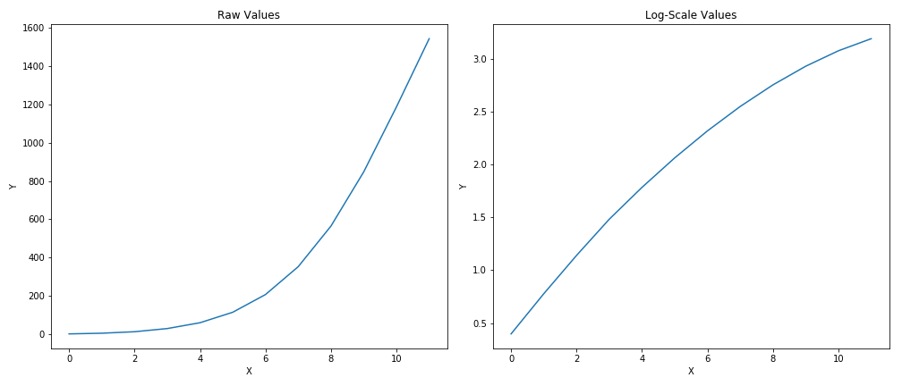
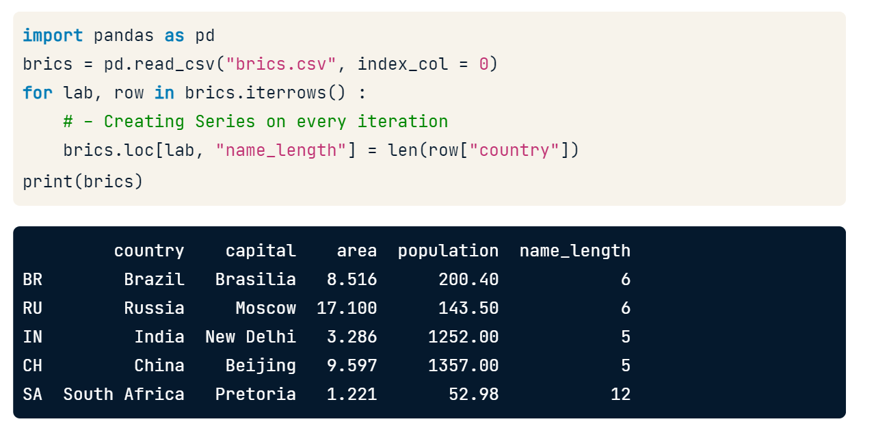
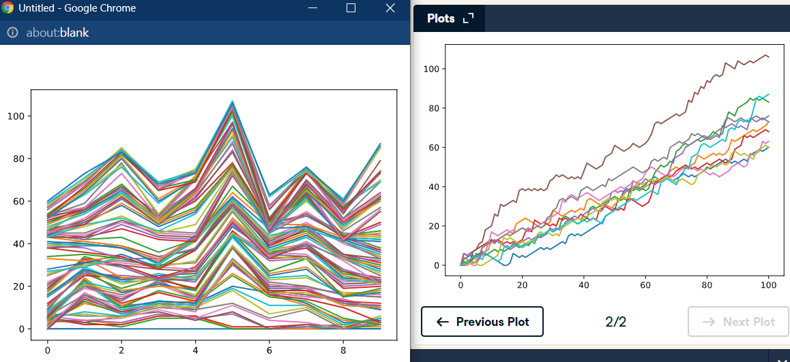

# Python
## Basics
- Types like str,list (everything in python) is object
- Depending on type object: list[2] finding by index is a method within object list type
- attributes in object are np.shape while methods are np.array() lke functions
- you cannot simply sum strings and integers/floats. So convert it using str(savings)
```
In [1]: True+True # addition converts int(True) = 1 and false to 0
Out[1]: 2
In [2]: True+False
Out[2]: 1
In [3]: True
Out[3]: True
```
## Lists
- list stores references not actual values (x=y if x any index value is changed then y also changes automatically) : <b> reference based copy</b>
- y =x[:] , list(x) will make y copy values instead of references unlike  equal sign : <b>explict copy </b>
- ["a","b"] type is class of lists
- Negative indexing,Slicing [-2:] (-2,-1) returned 0 is exclusive
- del(fam[2]) : deletes at index 2
```
command1; command2 # Same line

In [2]:
x
Out[2]:
['a', 'b', 'c', 'd']
In [3]:
x[2:] = ["s"] ......... #replaces values
In [4]:
x
Out[4]:
['a', 'b', 's']

del(areas[-4:-2]) #deletes values
```
## Functions, Methods and Packages
 - round(1.68,1) gives 1.7 otherwise defaults to integer without 2nd argument in function
 - round(number [,ndigits]) here ndigits **indicate optional arguments in square brackets**
 - help(max) or ?max if ipython
 - sorted(iterable, /, *, key=None, reverse=False)
- Functions in objects are called methods. String object has captialize,replace etc
```
fam.index("mom")
fam.count("mom") #returns how many times mom apears in fam list
"liz".replace("z","sa")
# help(str) to get all methods of string object type
# help(str.count)
# help(list.reverse) will show list is reversed with inplace true no returns needed like append method : areas.append(15.45) :float added to index without return
# import package and then use help on it to get methods,types etc
```
- **Package** list of python scripts:each script is module (contains functions,methods,new python types, attributes)
- numpy for efficient array,matplotlib,scikitlear are some packages
- install packages and enter it in code to use it
- pip is package manager (python3 get-pip.py then pip3 install numpy then import numpy as np to use it in your code or from numpy import array,linspace instead of np.array(),np.linspace() )
- from scipy.linalg import inv as my_inv :  uses the function inv() as my_inv(), which is in the linalg subpackage of the scipy package.

## Numpy
- height[4.5,3.4] / width[56,75] (if lists) gives error:cannot **perform element wise** unlike numpy array : which is easy,superfast
- element wise in numpy assumes same type in list np.array([1.0,True,"is"]) gives string list : **type coercion**
- numpy array add (+) gives elementwise addition unlike lists concatenation and **bmi[bmi>23]** (elmentwise true for bmi>23 : selection)
- np_2d.shape gives 2 rows 5 columns example of numpy.2dimensional array type. np_2d[0][1] (np_2d[0,1]) same as lists in lists


#### Statstics
- np.mean(),np.std(),np.sort(),np.sum(),np.corrcoef(),np.median() : middle value after sorting, useful for example if avg weight is 2000 data-wrong among all measurments : statstics useful to find outliers
- numpy single datatype in array speeds up calculations. also gpu multi threading etc
- Random height create : height=np.random.normal(1.75,0.20,5000) which is mean,sd,and number of samples and np.columnstack((height,weight))
- An average height of 1586 inches, that doesn't sound right, does it? However, the median does not seem affected by the outliers: 74 inches makes perfect sense. It's always a good idea to check both the median and the mean, to get an idea about the overall distribution of the entire dataset. : too large outliers changed average
- Do big players tend to be heavier? Use np.corrcoef() to  get correlation between height and weight
- In statistics, a correlation coefficient is a quantitative assessment that measures both the direction and the strength of this tendency to vary together. correlation H and W = 0.694 from all values : example
- A low standard deviation indicates that the values tend to be close to the mean (also called the expected value) of the set, while a high standard deviation indicates that the values are spread out over a wider range.




## Matplotlib
-   pyplot subpackage of matplotlib : import matplotlib.pyplot as plt
- plt.plot(year,month) and plt.show() needed to show because we need to add details : # Put the x-axis on a logarithmic scale...........plt.xscale('log')
- plt.scatter() is not connected by line. only dots . usually used to find correlation
- log scale is used to find values large difference changes apart example. 100  = 2 and 100000 = 5
- A logarithm is the answer to the question what power x do I need to apply to the base b in order to obtain the number y : log_b(y) = x
- So logarithms can quickly tell us whether the rate of change of something is increasing (like a car speeding up), staying constant, or decreasing 
- rates = [1.5, 1.4, 1.3, 1.2, 1.0, 0.9, 0.8, 0.7, 0.6, 0.5, 0.4, 0.3]


- Histogram bins with x as list and y number of bins (default=10) plt.hist(x,bins=n)
- plt.clf() cleans it up again so you can start afresh.
- Customization the story you want to tell on data
- xlabel,ylabel,title,plt.yticks([0,2,4,6,8,10],[0,2B,4B,6B,8B,10B]) starts from and ends instead of default. second argument changes the index to name
- plt.scatter(gdp_cap, life_exp, s = np_pop),  size of the dots corresponds to the population. S gives width like 3rd dimension
- dict = {
    'Asia':'red',
    'Europe':'green',
    'Africa':'blue',
    'Americas':'yellow',
    'Oceania':'black'
}
plt.scatter(x = gdp_cap, y = life_exp, s = np.array(pop) * 2, c= col, alpha = 0.8). where c will give color .in list created by dict. and alpha gives opacity to bubbles
-  plt.grid(True) - Add grid() call 
- plt.text(1550, 71, 'India') - they addd words india to plot


## Dictionaries and Pandas
- Keys are unique, immutable object- cannot be changed after created, check keys using, key in dict . dict(world['sealand']) to remove lements
- list is collection of values where order matters select entire subsets unlike dictionary where lookup keys matters
- pandas is tabluar data. Example row is observation (has unique labels) and variables as columns
- **Pandas** works for different data types unlike numpy only limited to single data type operation for dimensions
- pd.Dataframe(dict) where dict value is list to represent rows/observations , automatically assigns from 0 . df.index =[] to assign labels to index. 
- pd.read_csv(".csv", index_col = 0) to assign first column as row index
- columns can be accessed like dictionary keys. single bracket gives series and double bracket gives dataframe
- rows using slice df[1:4]
- loc based on labels, df.loc(["RU","IN"],['country','capital']), df.loc([:,:])
- i loc uses index. **series single bracket**. bunch of series put together gets a dattaframe. **double brackets** df[['country']] gives dataframe or print(cars.iloc [:,[2]] ) for dataframe instead of series print(cars.iloc[:,2])

## Loops, Filtering, Logic
- integers,strings are uncomparable unlike floats,integers. In words alphabets are comparable
- numpy comparision works elementwise selection bmi[bmi>23]
- AND, OR in mumpy not directly compatible for elementwise with numpy arrays.  Need to use np.logical_and
- enumerate also prints index and value itself
- for loop in 2darrays like np.array([np_height, np_weight]) only prints 1d array need to use np.nditer(). this prints indidvudually rows then columns unlike before at a time
- pandas for loop iters over columns if want rows need to call iterrows method which will generate label of row and actual data of row (pandas series)


- large dataframe becomes slow (series object is created on every iteration) better use **apply method** for faster performance. Applys element wise  
brics['name_length'] = brics["country"].apply(len). some other types are .apply(str.upper)
- Hacker statstics helps in getting probabilty,statstics by large experiements in practice
- pseudo random nubers : np.random.rand() between 0 and 1 where seed is choosed by python
- np.random.seed(123) and then calling .rand() will be consistent. If you set the same seed again it will be repeated. psudo random but consistent between anaylysis. reproducible
- np.random.randint(0,2) integers  generate
- Random walk is sequence of random steps
- if you pass max() two arguments, the biggest one gets returned. variable x never goes below 10 when you decrease it, you can use: x = max(10,x-1)
- Simulate 10  random times with 100 dice throws. Transpose np_aw by calling np.transpose() on np_aw. Call the result np_aw_t. Now every row in np_all_walks represents the position after 1 throw for the 10 random walks.


- There's still something we forgot! You're a bit clumsy and you have a 0.1% chance of falling down
```
        # Implement clumsiness
        if np.random.rand() <= 0.001 :
            step = 0
```
- histogram to find odds that you reach 60 steps or higher is plotted. usually gaussian distribution is observed for large experiements
- 